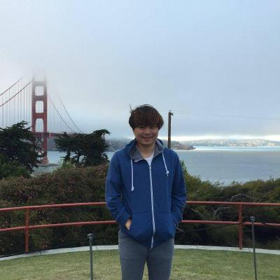

# TensorFlow 图形检测 — 使用 Google Colab 进行自定义对象检测
## 組員：
## 11124132吳秉育
## 11124138李奕陞
## 11124113王威勝
发布于 2020-11-12


在此文章中，我们将使用 TensorFlow 对象检测 API 构建自定义对象检测器。
本文示范检测「苹果果实」，但你也可以选择其他任何自定义对象。

---

## 步骤：

1. Installation
2. Gathering data
3. Labeling data
4. Generating TFRecords for training
5. Configuring training
6. Training model
7. Exporting inference graph
8. Testing object detector

---

## 一、Installation

Python 3.6 或更高版本
Ubuntu 18.04 / Google Colab
TensorFlow / TensorFlow-GPU


---

### 克隆 TensorFlow 模型存储库

```bash
git clone https://github.com/tensorflow/models.git
# 从这一点开始，此目录将被称为 TFmodels 目录
```


---

### 搭建环境与 Protobuf 编译

TensorFlow 对象检测 API 使用 Protobuf 配置模型与训练参数。
在使用该框架前，必须先编译 Protobuf 库（在 `/models/research/` 目录运行）。


---

## 二、Gathering data

2.1 打开 Google Chrome 并安装「Download All Images」扩展程序。


2.2 搜索目标物（此例为 “Apple”），点击右上角扩展按钮批量下载。


---

## 三、 Labeling data 

打开您的终端并通过以下方式安装LabelImg LabelImg是图形图像注释工具。 
安装labelImg后，通过键入将其打开


在不同的环境中安装labelImag方法不同，可以参照如下：


我标记了约 100 张图片。
现在克隆我的存储库


---

## 四、Generating TFRecords for training 
现在，将图像文件的70％复制到训练文件夹图像/训练中，其余30％复制到测试文件夹中。 
在标记了图像的情况下，我们需要创建TFRecords用作输入数据以训练对象检测器。
为了创建TFRecords，我们将使用



两个脚本。即xml_to_csv.py和generate_tfrecord.py文件。
```text
! git clone https://github.com/zjgulai/Tensorflow-0bject-Detection-API-With-Custom-Dataset.git
```


目錄：

```text
-data
-images
  -train
    -image1.jpg
    -imagel.xml.  
-test
  -image5.jpg
  -image5.xml.
-generate_threcord.py
-object-detection.pbtxt
-transform_image_resolution.py
-xmL_csv.py
-webcam_inference.py
```

现在在该文件夹中，我们可以通过打开命令行并键入以下内容，将XML文件转换为train_label.csv和test_label.csv：
```text
!python xml_to_csv.py
```
它们在数据目录中创建两个文件。一个叫做test_labels.csv，另一个叫做train_labels.csv。

```text
# TO-DO replace this with label map, replace with your own classes
def class_text_to_int (row_label):
  if row_label = 'apple':
    return 1
  else:
    return 0
```
如果你有多类标记

```text
#TO-DO replace this with label map def class_text_to_int (row_label) :
  if row_label == 'apple':
    return 1
  elif row_label == 'banana':
    return 2
  elif row_label == 'orange':
    return 3
  else:
    return None
```
现在，您可以通过键入以下内容来生成TFRecords：

```text
python3 generate_tfrecord.py --csv_input=data/train_labels.csv --output_path=train.record --image_dir=images/train
python3 generate_tfrecord.py --csv_input=data/test_labels.csv --output_path=test.record --image_dir=images/test
```
这两个命令生成一个train.record和一个test.record文件，可用于训练我们的对象检测器。


---

## 五、 Configuring training

训练之前，我们要做的最后一件事是create a label map and a training configuration file.

---
## 六、 Creating a label map

The label map maps : an id to a name.
I have already created a label map file for my training. It looks like this:

編輯: object-detection.pbtxt
```text
item{
  id:1
  name: "apple"
｝
```
如果您使用多个类，请遵循此模式。

```text
item {
  id: 1
  name: 'apple'
｝
item {
  id: 2
  name: 'banana'
}
item {
  id: 3 name:
  name'orange'
｝
item {
  id: 4
  name: 'etc'
｝
```

label map 文件将类别 ID 对应到名称：

```text
item {
  id: 1
  name: 'apple'
}
```

---

## 七、 Creating a training configuration
我们将在Google Colab中训练我们的模型。

I am using "SSD_MOBILENET_V2" for training and with the batch size of 4.

You can change the number of steps, which pre-trained model? to use & the batch and size.

然后，您需要运行以下单元格。将有一个Upload TF Record提示。

在此之下，您需要上传生成的

  1. train.record
  
  2. test.record
  
  3. object-detection.pbtxt

---

## 八、Training model
现在，在上传所有这些文件之后，运行下面的所有单元格。它将得到训练


---

## 九、Exporting inference • graph

如果已运行所有单元，则最后将下载一个名为Frozen_inference_graph.pb的文件。

---

## 十、Testing Object Detector
现在，将Frozen_inference_graph.pb文件复制到我的GitHub克隆文件夹中。然后，您需要在该webcam_inference.py中进行一些编辑，以测试您自己的对象检测器。打开该文件并检查代码。
如果您正确执行了上述所有步骤，则可以通过网络摄像头测试模型。


---

## 十一、 Conclusion
Tensorflow对象检测API允许您使用转移学习技术创建自己的对象检测器。
代码链接：
https://github.com/zjgulai/Tensorflow-Object-Detection-API-With-Custom-Datasetgithub.com
## 参考文献和链接：
1. https://github.com/tensorflow/models/tree/master/research/object_detection
2. https://medium.com/@WuStangDan/step-by-step-tensorflow-object-detection-api-tutorial-part-1-selecting-a-model-
a02b6aabe39e
3. https://pythonprogramming.net/introduction-use-tensorflow-object-detection-api-tutorial/
4. https://towardsdatascience.com/creating-your-own-object-detector-ad69dda69c85
https://medium.com/analytics-vidhya/custom-object-detection-with-tensorflow-using-google-colab-7cbc484f83d7
http://weixin.qq.com/r/5TaGnkTEZhkZrQD992-3（二维码自动识别）
