# TensorFlow 图形检测 — 使用 Google Colab 进行自定义对象检测

发布于 2020-11-12


在此文章中，我们将使用 TensorFlow 对象检测 API 构建自定义对象检测器。
本文示范检测「苹果果实」，但你也可以选择其他任何自定义对象。

---

## 步骤：

1. Installation
2. Gathering data
3. Labeling data
4. Generating TFRecords for training
5. Configuring training
6. Training model
7. Exporting inference graph
8. Testing object detector

---

## 一、Installation

Python 3.6 或更高版本
Ubuntu 18.04 / Google Colab
TensorFlow / TensorFlow-GPU

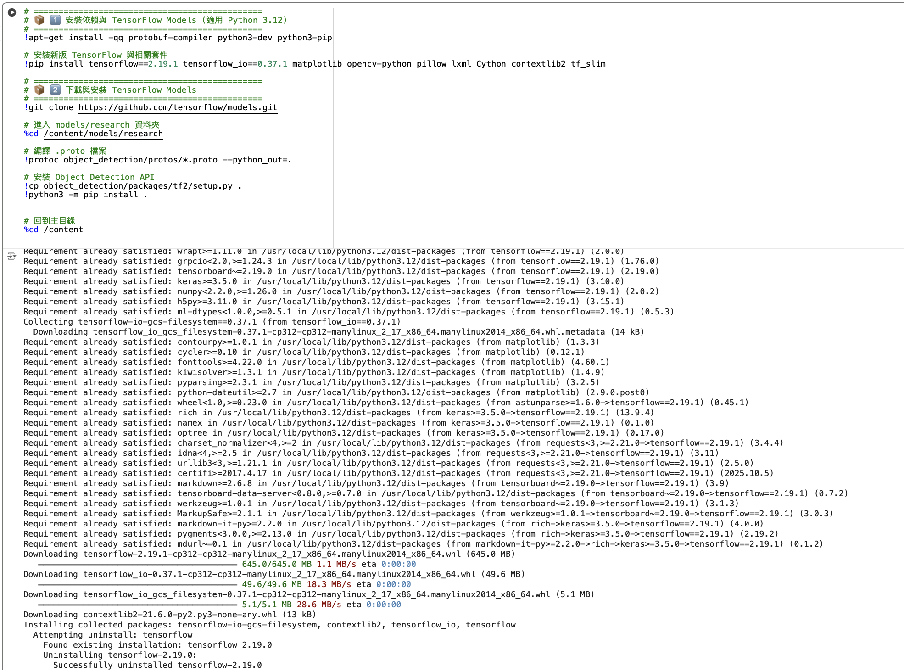

---

### 克隆 TensorFlow 模型存储库

```bash
git clone https://github.com/tensorflow/models.git
# 从这一点开始，此目录将被称为 TFmodels 目录
```

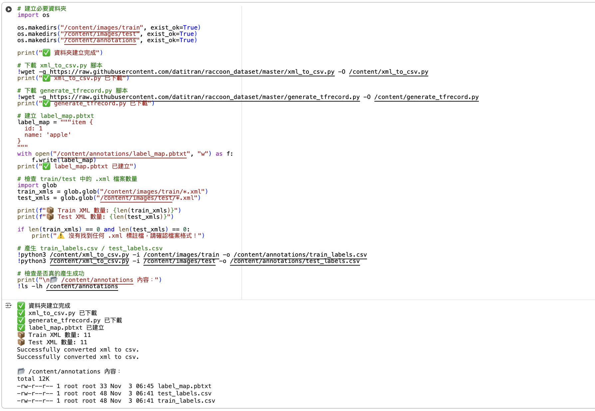

---

### 搭建环境与 Protobuf 编译

TensorFlow 对象检测 API 使用 Protobuf 配置模型与训练参数。
在使用该框架前，必须先编译 Protobuf 库（在 `/models/research/` 目录运行）。

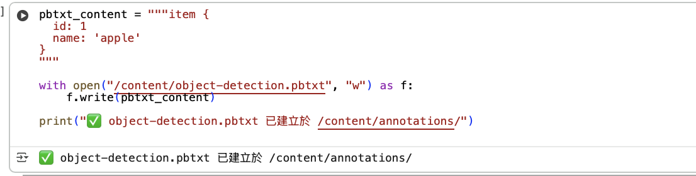

---

## 二、Gathering data

2.1 打开 Google Chrome 并安装「Download All Images」扩展程序。


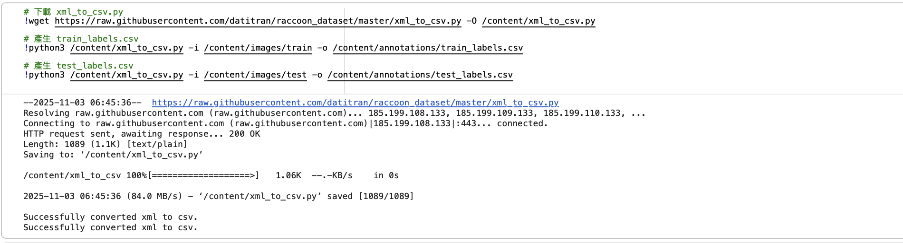

2.2 搜索目标物（此例为 “Apple”），点击右上角扩展按钮批量下载。
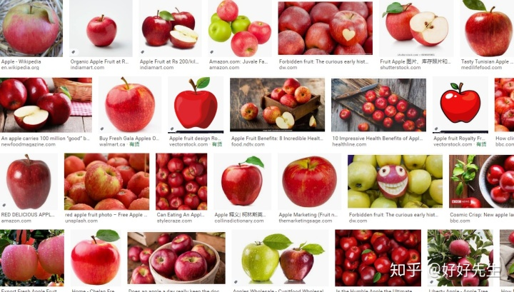

---

## 三、 Labeling data 

打开您的终端并通过以下方式安装LabelImg LabelImg是图形图像注释工具。 
安装labelImg后，通过键入将其打开

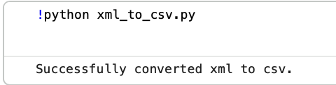

在不同的环境中安装labelImag方法不同，可以参照如下：
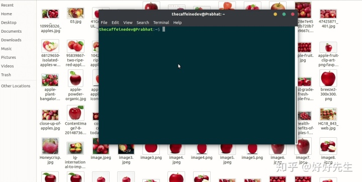

我标记了约 100 张图片。
现在克隆我的存储库


---

## 四、Generating TFRecords for training

将图像文件的 70% 放入 `images/train`，其余 30% 放入 `images/test`。
执行 `xml_to_csv.py` 生成 `train_labels.csv` 与 `test_labels.csv`，
接着使用 `generate_tfrecord.py` 生成 `train.record` 与 `test.record`。

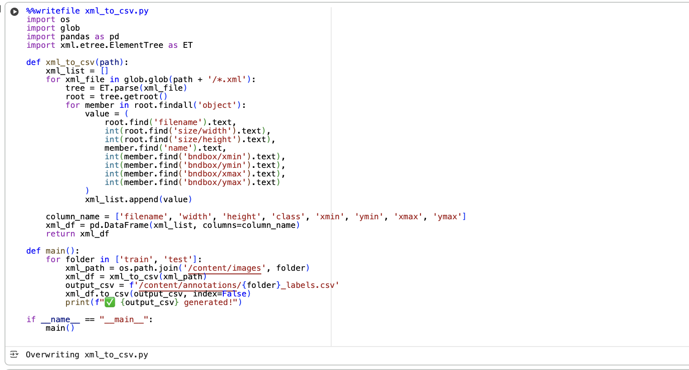

---

## 五、Configuring training

在训练前需创建 label map 与训练配置文件。

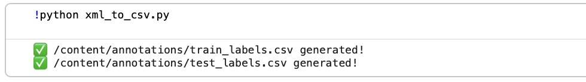

---

## 六、Creating a label map

label map 文件将类别 ID 对应到名称：

```text
item {
  id: 1
  name: 'apple'
}
```

---

## 七、Creating a training configuration

我们在 Google Colab 中训练模型，
此处使用 `SSD_MOBILENET_V2`，batch size 为 4。
可调整训练步数与预训练模型。

---

## 八、Training model

上传生成的 `train.record`、`test.record`、`object-detection.pbtxt` 文件后，
运行训练单元格开始训练。

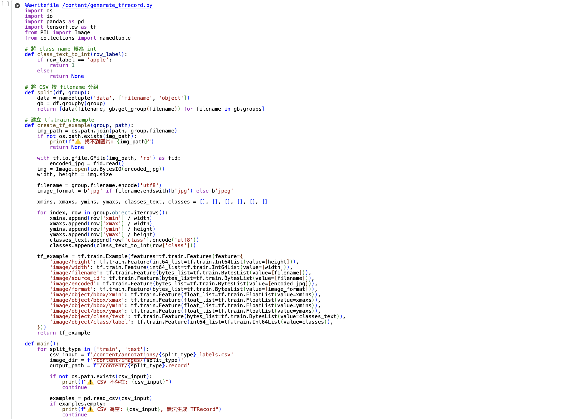


---

## 九、Exporting inference graph

训练完成后导出 `frozen_inference_graph.pb` 文件，
用于模型推论阶段。

---

## 十、Testing Object Detector

将 `frozen_inference_graph.pb` 放入测试文件夹中，
执行 `webcam_inference.py` 测试模型。

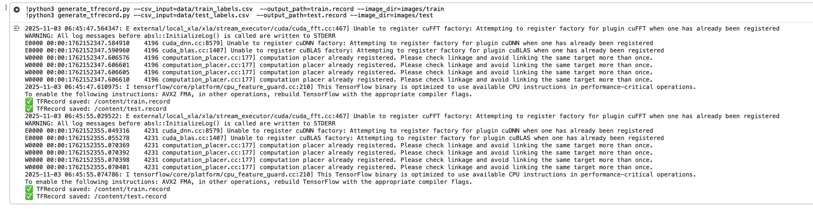

---

## 十一、Conclusion

TensorFlow 对象检测 API 允许使用迁移学习创建自定义对象检测器。
此流程已成功实作出对苹果物体的识别与定位。

---

## 参考文献与链接

* [TensorFlow Models 官方库](https://github.com/tensorflow/models/tree/master/research/object_detection)
* [TensorFlow 图形检测原文参考 (CSDN)](https://blog.csdn.net/weixin_39884078/article/details/110385105)
* [Medium 教程 - TensorFlow Object Detection](https://medium.com/@WuStangDan/step-by-step-tensorflow-object-detection-api-tutorial-part-1-selecting-a-model-a02b6aabe39e)
* [Towards Data Science 教学文](https://towardsdatascience.com/creating-your-own-object-detector-ad69dda69c85)
* [PythonProgramming.net 教学](https://pythonprogramming.net/introduction-use-tensorflow-object-detection-api-tutorial/)
