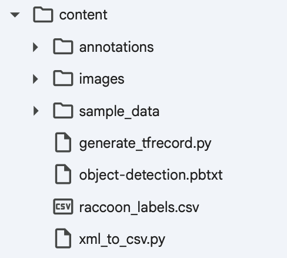

# tensor_flow
南華大學人工智慧期中作業－TensorFlow 環境建置與物件偵測

# 南華大學人工智慧期中作業：TensorFlow 物件偵測實作

本專案依照課堂範例與指定網站內容進行 TensorFlow Object Detection API 的實作。
**所有圖片均為我們實際在 Google Colab 執行所截取的成果畫面。**

---

## 一、環境建置與安裝

首先在 Colab 安裝 TensorFlow 及相關依賴，並下載官方 Models 專案。

---

## 二、Gathering data

本次專案以「蘋果辨識」為主題，資料蒐集自 Google Images。
使用「Download All Images」外掛批次下載圖片，並手動挑選品質較佳的樣本。

---

## 三、Labeling data

使用 `LabelImg` 進行圖片標註，為每張蘋果圖片框出目標範圍並生成對應的 `.xml` 標籤檔。
人工標註作業由組員完成如下：

---

## 四、Generating TFRecords for training

標註完成後，將資料依比例分為 `train` 與 `test` 兩個資料夾。
執行 `xml_to_csv.py` 將標籤轉換為 `train_labels.csv` 與 `test_labels.csv`，再使用 `generate_tfrecord.py` 產生 `train.record` 與 `test.record`。

專案結構如下：

---

## 五、Training model

於 Google Colab 執行 TensorFlow Object Detection API 的訓練腳本。
設定批次大小 (batch size)、學習率等參數後進行訓練。

---

## 六、Testing Object Detector

模型訓練完成後匯出 `frozen_inference_graph.pb`，再於本地端測試。
偵測結果如下圖所示，可正確辨識輸入影像中的物件：

---

## 七、環境資訊

* 執行平台：Google Colab (Python 3.12)
* TensorFlow 版本：2.19.1
* 套件：opencv-python, pillow, lxml, Cython, tf_slim, matplotlib, protobuf, pandas

---

## 八、參考來源

* [Tensorflow图形检测_使用Google Colab使用Tensorflow进行自定义对象检测](https://blog.csdn.net/weixin_39884078/article/details/110385105)
* [原始程式參考來源](https://github.com/kevin945290/AI_report)
